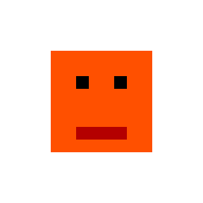

<p align="center">
  <b>English</b> · <a href="LEEME.md">Español</a>
</p>

<div align="center">


# DevTools

### Two small workshop tools: one for audio, one for pixel art.

`audiodit` cuts, mixes and processes sound from the terminal — and turns a hummed
melody into notes. `pixedit` turns a sprite into **plain text you can diff in git**,
and back.

[](LICENSE)
[](https://www.python.org/)


</div>

---

## What it is

Two tools that have nothing to do with each other except that they were needed by
the same person on the same afternoon, and they share a folder. Both work the
same way: a **command-line interface** for doing the job, and an optional
**graphical interface** for when you'd rather see what you're doing.

They install independently. If you only want the sprite one, you never need
ffmpeg.

## Purpose and scope

**The purpose.** Small, sharp tools for jobs that usually mean opening something
enormous. Trimming thirty seconds out of an MP3 should not require launching a
DAW, and versioning a 16×16 sprite should not mean committing an opaque binary
blob every time you move one pixel.

**What it covers.** Everyday audio edits from a script or a prompt, and a
round-trippable text format for small pixel art.

**What it does not do.** Neither of these is trying to replace Audacity or
Aseprite. There is no timeline, no layers, no animation — on purpose.

## Contents

- [audiodit — audio from the terminal](#audiodit--audio-from-the-terminal)
- [pixedit — pixel art as text](#pixedit--pixel-art-as-text)
- [On Windows](#on-windows)
- [For developers](#contributing)

## audiodit — audio from the terminal

```bash
pip install pydub numpy librosa      # plus ffmpeg on your PATH
python audiodit.py --help
```

| command | what it does |
|---|---|
| `audiodit info cancion.mp3` | Length, format, channels, bitrate. |
| `audiodit cut cancion.mp3 0:30 1:45 fragmento.mp3` | Trim by timestamp, not by sample number. |
| `audiodit concat intro.mp3 loop.mp3 outro.mp3 -o final.mp3` | Glue files together. |
| `audiodit overlay voz.wav musica.mp3 -o mezcla.mp3` | Lay one on top of another. `--offsets 0 4.5` starts the second one late. |
| `audiodit volume track.mp3 +6 louder.mp3` | Gain in dB, signed. |
| `audiodit speed track.mp3 1.5 rapido.mp3` | Speed up or slow down. |
| `audiodit fade track.mp3 suave.mp3 --in 2 --out 3` | Fade in and out, in seconds. |
| `audiodit normalize track.mp3 norm.mp3` | Even out the level. |
| `audiodit bitrate track.mp3 128 comprimido.mp3` | Re-encode smaller. |
| `audiodit effects track.mp3 fx.mp3 --reverb 0.4 --bass 4` | Reverb and EQ. |
| `audiodit hum2notes tarareada.wav --midi` | **Hum a melody, get the notes.** Pitch-tracks the recording and writes out what you sang, optionally as MIDI. |
| `audiodit gui` | The window, for the same operations. |

`hum2notes` is the one worth knowing about: it is the difference between "I have
a tune in my head" and "I have a MIDI file", without touching an instrument.

## pixedit — pixel art as text

```bash
pip install pillow
python pixedit.py --help
```

The point of this one is the format. A `.px` file is a palette plus a grid of
indexes — **readable, editable and diffable**:

```
size: 16x16
palette:
  0: #00000000
  1: #FF5000
  2: #000000
  3: #B40000
pixels:
0000000000000000
0000111111110000
0000111111110000
0000112112110000
0000111111110000
0000111111110000
0000113333110000
0000111111110000
0000000000000000
```

<p align="center">

</p>

That's the actual `test_sprite.px` in this repo, and the image beside it is what
`pixedit decode` makes of it. Move one pixel and `git diff` shows you one
character changing — instead of *"Binary files differ"*.

| command | what it does |
|---|---|
| `pixedit encode sprite.png` | PNG → `.px` |
| `pixedit decode sprite.px` | `.px` → PNG |
| `pixedit preview sprite.png [scale]` | Window with the sprite blown up (×8 by default). |
| `pixedit scale sprite.png 4` | Nearest-neighbour resize — no blur. |
| `pixedit info sprite.png` | Dimensions and colour count. |
| `pixedit palette sprite.png` | Lists the palette. |
| `pixedit gui [file]` | The editor. |

## On Windows

The `.cmd` files are wrappers: put the folder on your `PATH` and you can call
`audiodit ...` and `pixedit ...` directly, without typing `python`.

<br>

---

<div align="center">

## 🔧 For developers

*Everything above is what they do. Everything below is how they do it.*

</div>

---

### Contributing

Concrete things that would help:

- **Animation in the `.px` format** — a frame separator would be enough, and it
  would keep the diffable property that makes the format worth having.
- **`audiodit` without ffmpeg** for the simple operations, so the install stops
  being a two-step affair.
- **Round-trip tests.** `encode` → `decode` → `encode` should be a fixed point,
  and right now nothing enforces that. `test_roundtrip.png` exists precisely
  because it was checked by hand once.

### What it's made of

| the hard part | what does it |
|---|---|
| Decoding and re-encoding anything (mp3, wav, ogg…) | `pydub`, and ffmpeg underneath |
| Working out which note a hum is | `librosa` pitch tracking |
| Arithmetic on samples | `numpy` |
| Reading and writing PNG, and the palette | `pillow` |
| Both windows | Tkinter, from the standard library |

The two tools **share nothing**, including their dependencies. That is
deliberate: `pixedit` is useful on a machine with no ffmpeg, and making them
share a base would have cost that.

### The files

| file | lines | what it is |
|---|--:|---|
| `audiodit.py` | 276 | The audio CLI. |
| `audiodit_gui.py` | 676 | Its window. |
| `pixedit.py` | 198 | The sprite CLI, and the `.px` reader and writer. |
| `pixedit_gui.py` | 646 | The sprite editor. |
| `test_sprite.px` / `test_sprite.png` | — | The same 16×16 sprite in both formats — the example this README uses. |
| `test_sprite_x4.png` | — | The output of `pixedit scale test_sprite.png 4`. |

In both cases the GUI is three times the size of the tool it wraps, which is
about right: the logic is small and the pixels are where the work goes.

### How the `.px` format works

Three sections, in order: `size:` with the dimensions, `palette:` mapping a
single character to an `#RRGGBBAA` colour, and `pixels:` with one line per row.

That design has one consequence worth stating: **a sprite is limited to as many
colours as there are index characters**. For pixel art this is a feature rather
than a limit — a constrained palette is what the style is made of — but it means
the format will never round-trip a photograph, and it isn't meant to.

Alpha lives in the palette, not in a separate channel: `#00000000` is the
transparent entry. That's why index `0` is the background in the example above.

### License

[MIT](LICENSE). Do what you like with them.

### Related projects

- **[Aseprite](https://www.aseprite.org/)** — *use that to actually draw;* use
  `pixedit` to get the result into version control in a form you can read.
- **[Audacity](https://www.audacityteam.org/)** — *use that when you need to see
  the waveform.* `audiodit` is for when you already know what you want and would
  rather type it.
- **ffmpeg** — the thing doing the real work under `audiodit`. If you're
  comfortable with its syntax you may not need this at all.
